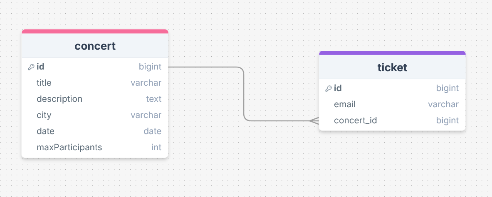
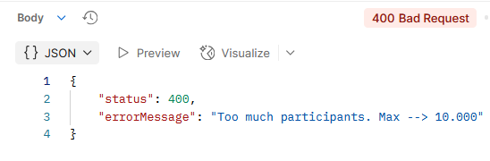
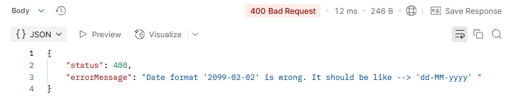
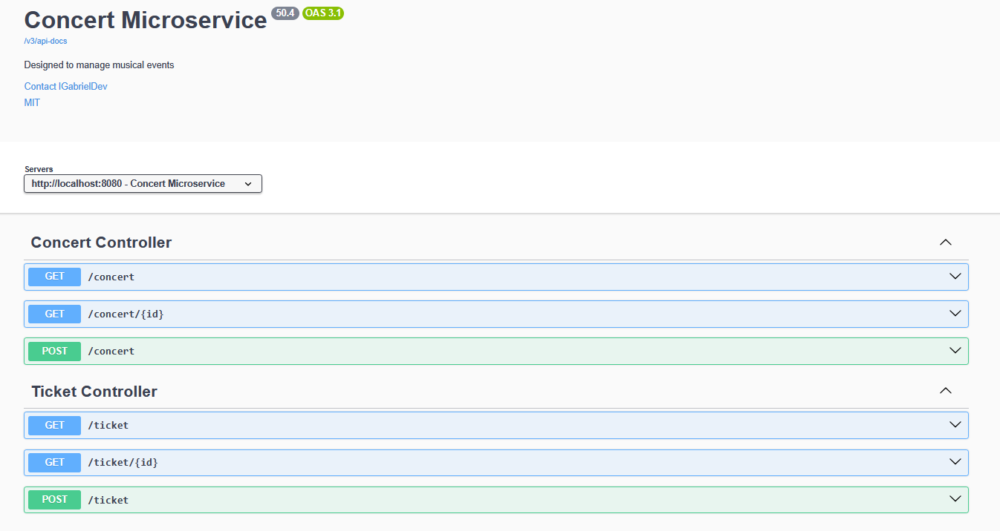
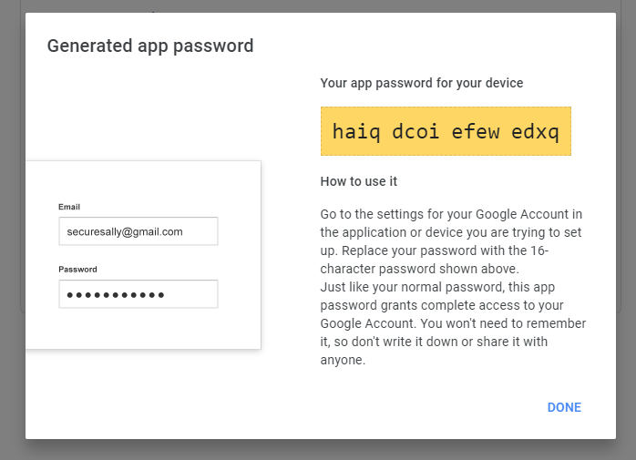

<!-- title -->
<h1 align="center">
    <span>Gestão de shows e envio de ingressos</span>
</h1>

<br>

<!-- badges -->
<div align="left">
    </img>
    </img>
    </img>
</div>

<br>

<!-- About -->
##  Sobre o Projeto

Grandes shows e eventos precisam de um sistema ágil e eficiente para gerenciar ingressos e garantir que o público os receba sem dificuldades. Para tornar esse processo simples, foi desenvolvida uma solução que cuida de tudo, desde a organização dos eventos até o envio dos ingressos por e-mail.

A solução é composta por dois microserviços:

- **Microserviço de Gestão de Eventos e Ingressos**

    Responsável por toda a administração dos shows e ingressos, desde a criação e atualização dos eventos até a geração dos ingressos em PDF. Após isso, encaminha os ingressos para o serviço de envio de e-mails.

<br>

- **Microserviço de Envio de E-mails**
    
    Focado exclusivamente no envio dos ingressos para o público, garantindo que cada cliente receba seu ingresso de forma rápida e segura. Utiliza JavaMailSender para um envio confiável.

<br>

<div align="center">
    
</div>


<br>
<br>

ℹ️ *O microserviço de Pagamento ainda não foi criado. Será implementado em uma versão futura do projeto.*

ℹ️ *O arquivo .pdf enviado ainda não foi editado. Será implementado em uma versão futura do projeto.*

<hr>
<br>


<!-- Technologies e dependencias -->
##  Tecnologias e dependencias
- Java 17
- Spring Boot 3.4.3
- Spring Web
- Spring Data JPA
- OpenFeign
- JavaMailSender
- PostgreSQL
- Docker
- OpenAPI (Swagger)


<hr>
<br>

<!-- Diagram -->
###  Diagrama de relacionamento

A aplicação trabalha com 2 entidades:

- Concert
- Ticket

<br>




> ℹ️ A entidade **Email** ainda não foi criada. Será implementada em uma versão futura do projeto.

<hr>
<br>


<!-- Validations -->
##  Validações

### Criação de concerts/shows

*Exempo do Objeto JSON enviado na requisicao*


```json
{
    "title": "Show tal tal tal",
    "description": "Show do artista tal",
    "city": "São Paulo - SP",
    "date": "09-09-2099", // Padrão BR --> dd-MM-yyyy
    "maxParticipants": 9000
}
```

Esses campos seguem as seguintes validações:

- **title**
    - Não pode ser null
    - Máximo 100 characters
    - Deve ser Único

    <br>

- **description**
    - Não pode ser null
    - Máximo 100 characters

    <br>

- **city**
    - Não pode ser null
    - Máximo 100 character

    <br>

- **date**
    - Não pode ser null
	- A data deve estar no formato br --> "dd-MM-yyyy"
	- Deve ser uma data posterior ao dia atual. Não pode ser data antiga

    <br>

- **maxParticipants**
    - Não pode ser null
    - Não pode ser String
    - Máximo 10.000 participantes

<br>
<br>

### Criação de tickets

*Exempo do Objeto JSON enviado na requisicao*

```json
{
  "email": "email_tal@gmail.com",
  "concertId":1
}
```


Esses campos seguem as seguintes validações:

- **email**
    - Não pode ser null
    - Máximo 100 characters
    - Deve possuir apenas um `@`
	- Deve ter algo antes e depois do `@`
	- Deve finalizar com `.com` ou `.br`

    <br>

- **concert_id**
    - Não pode ser null
	- Não pode ser String
	- concertId deve ser válido
	- Não pode ultrapassar o limite de participantes
	- O mesmo email não pode ser cadastrado duas vezes no mesmo show

<hr>
<br>

<!-- Custom Exception Handler -->
##  Lançamento de exceções customizadas

Todas as exceções foram personalizadas para um melhor entendimento do usuário

<br>

**Exemplo 1**

	
	
<br>

**Exemplo 2**

	

<hr>
<br>

## Documentação no Swagger

<br>

	

<hr>
<br>

##  Endpoints

### Concert Controller
| Método Http    | URI                                           | Descrição                         | Status Code esperado |
| :---:          | :---                                          |  :---                             |  :---:  | 
| POST           | `http://localhost:8080/concert`               | Cria um show                      | 201     |
| GET            | `http://localhost:8080/concert`               | Lista todos os shows              | 200     |
| GET            | `http://localhost:8080/concert/{id}`          | Retorna um show através do #ID    | 200     |


<br>

### Ticket Controller
| Método Http    | URI                                           | Descrição                          | Status Code esperado |
| :---:          | :---                                          |  :---                              |  :---:  | 
| POST           | `http://localhost:8080/ticket`                | Cria um ticket                     | 201     |
| GET            | `http://localhost:8080/ticket`                | Lista todos os tickets             | 200     |
| GET            | `http://localhost:8080/ticket/{id}`           | Retorna um ticket através do #ID   | 200     |

<hr>
<br>

<!-- Build and run -->
##  Rodando a aplicação

### Requisitos

- Docker 27.0.3
- Gmail account
- Gmail app password

<br>

### Passo a passo


1. Gerar sua senha app google

    	

    Siga as instruções para gerar sua senha de aplicativo --> <a href="https://support.google.com/mail/answer/185833?hl=en">google app password</a>

    <br>

    ℹ️ *imagem retirada do blog https://blog.rebex.net/gmail-using-app-passwords*

<br>
<br>


2. Clone esse repositório
    ```bash
    git clone https://github.com/lGabrielDev/microservices_concert_email
    ```

<br>
<br>

3. Vá para o diretório do projeto

    ```bash
    cd microservices_concert_email
    ```

<br>
<br>

4. Atribua os valores nas variables do arquivo **.env**

    

    <br>

    - **gmail_password** --> Google app password que geramos anteriormente

    <br>

    ⚠️ Somente contas Gmail são suportadas. Outros provedores de e-mail não funcionam.


<br>
<br>

5.  Iniciar a aplicação com o Docker

    Após configurar o arquivo `.env`, basta rodar o comando abaixo para iniciar os containers da aplicação:
    
    ```bash
    docker compose up;
    ```

<br>
<br>

6. Acessar o Swagger para interagir com a API

    http://localhost:8080/swagger-ui.html`

<hr>
<br>

<!-- Credits -->
<h2>
    
    <span>Créditos</span>
</h2>

<p>As imagens usadas nesse projeto foram retiradas dos seguintes sites:</p>

- [shields.io](https://shields.io/)
- [iconfinder](https://www.iconfinder.com/)
- [storyset](https://storyset.com/)
- [blog.rebex](https://blog.rebex.net/)

<br>

<span>Thanks!</span>

<hr>
<br>

<!-- License -->
##  Licença MIT

O projeto está sob a licença do [MIT](./LICENSE).

<hr>
<br>

<!-- Author -->
##  Autor

<br>

<div align="center">
    
    <p> <a href="https://github.com/lGabrielDev">Gabriel Freitas</a> 😎 </p>
</div>